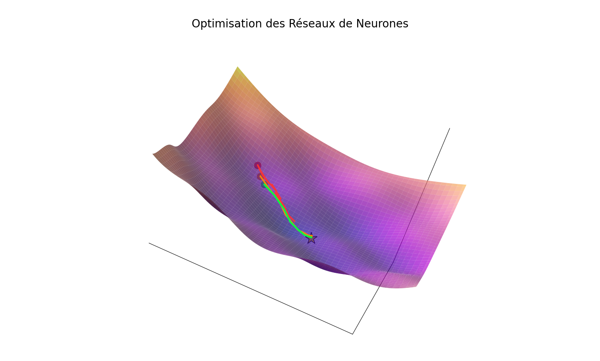

# Optimization - Techniques d'optimisation essentielles en Machine Learning

## Introduction

L'optimisation est au cœur de l'apprentissage automatique. Ce module explore les techniques avancées pour améliorer la vitesse et la qualité de l'entraînement des réseaux de neurones, depuis la normalisation des données jusqu'aux optimiseurs adaptatifs.

## Pourquoi l'optimisation ?

L'optimisation permet de :
- **Accélérer la convergence** : Atteindre le minimum plus rapidement
- **Améliorer la stabilité** : Éviter les oscillations et divergences
- **Dépasser les minima locaux** : Explorer mieux l'espace des paramètres
- **Gérer de grandes datasets** : Entraîner efficacement avec des mini-batches
- **Normaliser les gradients** : Éviter les problèmes de vanishing/exploding gradients

## Comment optimiser l'entraînement ?

### Progression des techniques :

1. **Préparation des données (0-3)** : Normalisation et mini-batches
2. **Optimiseurs avancés (4-10)** : Momentum, RMSprop, Adam
3. **Techniques de régulation (11-14)** : Learning rate decay, batch normalization

### Pipeline d'optimisation :

```
Données brutes → Normalisation → Mini-batches → Optimiseur avancé → Batch Norm
      ↓              ↓              ↓             ↓                  ↓
  Stabilité    Convergence    Efficacité   Vitesse/Qualité    Stabilité interne
```

## Quand utiliser chaque technique ?

### Normalisation des données :
- **Toujours** : Pour des features de différentes échelles
- **Effet** : Améliore la convergence et stabilité

### Mini-batch Gradient Descent :
- **Grandes datasets** : Quand les données ne tiennent pas en mémoire
- **Compromis** : Entre précision (batch) et vitesse (stochastique)

### Optimiseurs :

#### SGD avec Momentum :
- **Usage** : Baseline solide, bon pour comprendre
- **Avantage** : Simple, prévisible
- **Inconvénient** : Nécessite tuning manuel

#### RMSprop :
- **Usage** : RNN, problèmes avec gradients variables
- **Avantage** : Adaptatif par feature
- **Inconvénient** : Peut converger trop rapidement

#### Adam :
- **Usage** : Choix par défaut pour la plupart des problèmes
- **Avantage** : Combine momentum et adaptation
- **Inconvénient** : Plus de paramètres à configurer

### Techniques avancées :

#### Learning Rate Decay :
- **Usage** : Pour affiner la convergence finale
- **Quand** : Après stabilisation initiale de l'entraînement

#### Batch Normalization :
- **Usage** : Réseaux profonds (>3 couches)
- **Effet** : Stabilise et accélère l'entraînement

## Concepts mathématiques

### Momentum :
- **Principe** : Accumule les gradients passés
- **Formule** : v = βv + (1-β)∇θ, θ = θ - αv

### RMSprop :
- **Principe** : Adapte le learning rate par paramètre
- **Formule** : s = βs + (1-β)(∇θ)², θ = θ - α∇θ/√(s + ε)

### Adam :
- **Principe** : Combine momentum et RMSprop
- **Formules** : Momentum + adaptation + bias correction

### Batch Normalization :
- **Principe** : Normalise les activations internes
- **Formule** : z̃ = γ(z-μ)/σ + β

---

## Lexique des termes utilisés

### A
- **Adam** : Adaptive Moment Estimation, optimiseur populaire
- **Adaptive** : Qui s'ajuste automatiquement aux données
- **Alpha (α)** : Taux d'apprentissage (learning rate)

### B
- **Batch** : Lot de données traité simultanément
- **Batch Normalization** : Normalisation par lot
- **Beta (β)** : Paramètre de momentum ou de decay
- **Bias Correction** : Correction de biais dans Adam

### C
- **Convergence** : Stabilisation vers un minimum
- **Constant** : Constante de normalisation

### D
- **Decay** : Diminution progressive (learning rate)
- **Data** : Données d'entraînement

### E
- **Epsilon (ε)** : Petite constante pour éviter division par zéro
- **Exponential** : Moyenne mobile exponentielle

### F
- **Feature** : Caractéristique ou variable d'entrée

### G
- **Gamma (γ)** : Paramètre d'échelle en batch normalization
- **Gradient** : Dérivée de la fonction de coût
- **Gradient Descent** : Descente de gradient

### L
- **Learning Rate** : Taux d'apprentissage
- **Local Minimum** : Minimum local de la fonction de coût

### M
- **Mini-batch** : Petit lot de données
- **Momentum** : Inertie, accumulation des gradients
- **Moving Average** : Moyenne mobile

### N
- **Normalization** : Normalisation des données ou activations
- **Numpy** : Bibliothèque Python pour calcul numérique

### O
- **Optimization** : Optimisation, recherche du minimum
- **Optimizer** : Optimiseur, algorithme d'optimisation

### R
- **RMSprop** : Root Mean Square Propagation
- **Random** : Aléatoire (pour le mélange)

### S
- **SGD** : Stochastic Gradient Descent
- **Shuffle** : Mélanger les données
- **Stabilization** : Stabilisation de l'entraînement
- **Standard Deviation** : Écart-type

### T
- **Training** : Entraînement du modèle

### V
- **Variable** : Variable à optimiser (poids, biais)
- **Variance** : Variance statistique

### W
- **Weights** : Poids du réseau de neurones

---

## Structure des fichiers

### Préparation des données (0-3) :
- `0-norm_constants.py` : Calcul des constantes de normalisation
- `1-normalize.py` : Normalisation Z-score
- `2-shuffle_data.py` : Mélange des données
- `3-mini_batch.py` : Création de mini-batches

### Optimiseurs (4-10) :
- `4-moving_average.py` : Moyenne mobile pondérée
- `5-momentum.py` : SGD avec momentum
- `6-momentum.py` : Momentum avec TensorFlow
- `7-RMSProp.py` : RMSprop from scratch
- `8-RMSProp.py` : RMSprop avec TensorFlow
- `9-Adam.py` : Adam from scratch
- `10-Adam.py` : Adam avec TensorFlow

### Techniques avancées (11-14) :
- `11-learning_rate_decay.py` : Decay inversement temporel
- `12-learning_rate_decay.py` : Decay avec TensorFlow
- `13-batch_norm.py` : Batch normalization from scratch
- `14-batch_norm.py` : Batch normalization avec TensorFlow

Chaque fichier `main.py` teste les implémentations avec des exemples pratiques.



In this article, we will explore seven fundamental techniques that transform a chaotic learning process into a controlled descent toward excellence.
## <font color=C0C0C0>Feature Scaling</font>

**Feature scaling** consists of bringing all values in a dataset to the same scale. This does not change the relationships between variables but makes learning easier by preventing some features from dominating others.


---
**Simplified example:**

<div align="center">

<strong>Model:</strong>  
$y = w \cdot salary$

</div>
---

- **Case 1: Without feature scaling**
    - $w$ = 0.10
        - Salary 20k → $y$ = 2,000
        - Salary 100k → $y$ = 10,000

    - $w$ = 0.12
        - Salary 20k → $y$ = 2,400
        - Salary 100k → $y$ = 12,000
            A small change of **+0.02 in the weight** leads to a huge difference of **+2,000** in the output.

- **Case 2: With feature scaling** (salary normalized between 0 and 1)
    - Salary 20k → 0
    - Salary 100k → 1
    - $w$ = 0.10 → outputs: 0 and 0.10
    - $w$ = 0.12 → outputs: 0 and 0.12  
    The same change of **+0.02 in the weight** leads to only **+0.02 in the output**.

Main scaling methods:


<details>
<summary><strong>Min-Max Scaling</strong></summary>

<div align="center">$x_{scaled} = \frac{x-x_{min}}{x_{max} - x_{min}}$</div>

- Brings values between 0 and 1
- Sensitive to outliers
</details>

<details>
<summary><strong>Standardization (Z-score)</strong></summary>

<div align="center">$x_{scaled} = \frac{x-\mu}{\sigma}$​</div>

- Centers data around 0 with a standard deviation of 1
- Less sensitive to outliers
</details>

**Advantages:** more stable and balanced learning, faster convergence.  
**Disadvantages:** all new data must be normalized in the same way; poor scaling can degrade performance.

## <font color=C0C0C0>Batch normalization</font>
**Batch normalization** addresses the problem of **internal covariate shift**: during training, the distributions of each layer's inputs constantly change, forcing subsequent layers to keep adapting.

**Assembly Line Analogy**
Imagine an assembly line where each neuron is a specialized worker.
Each worker produces a part (its activation) for the next worker.
Without normalization, the parts arrive in completely different sizes in each batch. The next worker must constantly readjust their tools and technique, slowing production and introducing instability.

Batch normalization standardizes each "part": now, all arrive with consistent dimensions, allowing each worker to focus on perfecting their craft rather than constant adaptation.


---
### Technical Mechanism

For each batch of size $m$, normalization follows these steps:

<div align="center">

1. **Compute the mean:**  
$\mu_B = \frac{1}{m} \sum_{i = 1}^{m} x_i$​

2. **Compute the variance:**  
$\sigma^2_B = \sum_{i = 1}^{m} (x_i - \mu_B)^2$

3. **Normalize:**  
$\hat{x}_i = \frac{x_i - \mu_B}{\sqrt{\sigma^2_B + \epsilon}}$

4. **Learned transformation:**  
$y_i = \gamma\hat{x}_i + \beta$

</div>
---

The parameters $\gamma$ and $\beta$ are learned during training, allowing the model to recover the original distribution if needed.

This method has several advantages. It allows for a **significant acceleration of convergence**, reducing the time needed to reach a satisfactory solution. It also allows the use of **higher learning rates**, while **reducing sensitivity to weight initialization**, making training more robust. Finally, it introduces a **slight regularization effect**, thus limiting some risks of overfitting.

However, this approach also has drawbacks. It incurs an **additional computational cost**, which can become limiting for complex models. Moreover, it strongly depends on the presence of **mini-batches**, which can be problematic during inference. It is also **less effective when batches are very small** and can generate **different behavior between training and inference**, requiring careful management of these differences.

## <font color=C0C0C0>Mini-batch gradient descent</font>
By default, a neural network works on **the entire dataset** provided to it. This approach is very effective in terms of learning quality, but much less so in terms of time and performance.

To address this issue, **mini-batch gradient descent** was created.  
Instead of processing all training data at once, the mini-batch, as its name suggests, **divides the dataset into small shuffled batches**, which are processed one after another.

This method allows working with smaller data volumes, speeding up learning. Moreover, shuffling data in each batch **prevents the network from simply memorizing the answers**, promoting more general and robust learning.

**Typical Batch Sizes**

- **32-64:** Small models, limited datasets
- **128-256:** Standard size, good balance
- **512-1024:** Large models with significant resources
- **>1024:** Advanced research, requires special techniques

This approach offers several advantages. It allows for **faster learning compared to using a full batch**, while promoting **better generalization thanks to the noise** introduced in the process. It also ensures **optimal GPU utilization**, improving hardware performance. Finally, it helps **avoid pure memorization of data**, making the model more capable of generalizing.

However, some drawbacks must be considered. The **gradient obtained is less precise than that calculated with a full batch**, which can slow down or disrupt convergence. Moreover, this method **requires careful adjustment of batch size**, a parameter that strongly influences the stability and efficiency of learning. Finally, **poor configuration can introduce instability**, compromising training quality.

## <font color=C0C0C0>Gradient descent with momentum</font>
**Gradient descent with momentum** adds a memory of the previous movement, creating inertia that stabilizes and accelerates convergence.

**The Rolling Stone Analogy**
Imagine a stone rolling down a hill toward a valley:

- **Without momentum:** The stone follows the exact local slope, zigzagging due to small bumps and roughness. It can get stuck in small pits.
- **With momentum:** The stone keeps part of its previous speed. It can cross small bumps thanks to its momentum and follows a smoother path to the bottom of the valley.


---
**Formula:**

<div align="center">

$v_t = \beta \cdot v_{t-1} + (1 - \beta) \cdot \nabla f(\theta_{t - 1})$

$\theta_t = \theta_{t - 1} - a \cdot v_t$

</div>
---

- $v_t$ is the "velocity" (momentum) at step t
- $\beta$ is the momentum coefficient (typically 0.9)
- $\alpha$ is the learning rate
- $\nabla f(\theta)$ is the gradient

**Advantages:** accelerates descent, avoids oscillations in narrow valleys.  
**Disadvantages:** if the momentum rate is poorly chosen, the stone can "slip" and overshoot the minimum.
## <font color=C0C0C0>RMSProp (Root Mean Square Propagation)</font>
If we take the rolling stone analogy from gradient descent with momentum, where momentum adds inertia to keep the stone moving in one direction, RMSProp adjusts the stone's speed based on the slope of the gradient.
The steeper the slope, the more the stone's speed is reduced; conversely, the flatter it is, the faster the stone goes.

**But why do this?**
You might think that rushing down a steep slope would get us to our goal faster, but actually, no.
Like a car at full speed down a hill, the risk of crashing or losing control increases dramatically.

In a model, it's the same: if gradients are too large, the weights may:
- Overshoot the minimum (the destination)
- Oscillate from one side of the valley to the other (circling the solution without ever stabilizing)
- Even explode (infinite values)


---
**Formula:**

<div align="center">

$s_t = \beta \cdot s_{t-1} + (1 - \beta) \cdot (\nabla f(\theta_{t-1}))^2$

$\theta_t = \theta_{t-1} - a \cdot \frac{\nabla f(\theta_{t-1})}{\sqrt{s_t} + \epsilon}$

</div>
---

RMSProp maintains a moving average of squared gradients and divides the current gradient by this square root. The larger the recent gradients, the smaller the step will be.

In summary, RMSProp does not seek raw speed, but stability and safety in the descent.
That's what makes it allow for much more effective convergence than Gradient Descent alone.

This method has several strengths: **automatic adaptation of the learning rate**, **good handling of highly variable gradients**, **stable convergence even with high initial rates**, and **particular efficiency on RNNs**.

Its limitations lie in its **sometimes overly conservative nature**, **problematic accumulation of past gradients**, and **reduced performance on some convex problems**.
## <font color=C0C0C0>Adam optimization (Adaptive Moment Estimation)</font>
Adam combines **momentum** and **RMSProp**: inertia + step adaptation according to the gradient.


---
**Formula:**

<div align="center">

$m_t = \beta_1 \cdot m_{t-1} + (1 - \beta_1) \cdot \nabla f(\theta_{t-1})$

$v_t = \beta_2 \cdot v_{t-1} + (1 - \beta_2) \cdot (\nabla f(\theta_{t-1}))^2$

$\hat{m}_t = \frac{m_t}{1-\beta_1^t}$

$\hat{v}_t = \frac{v_t}{1-\beta_2^t}$

$\theta_t = \theta_{t-1} - a \cdot \frac{\hat{m}_t}{\sqrt{\hat{v}_t} + \epsilon}$

</div>
---


**Advantages:** fast and stable convergence, widely used as the default optimizer.  
**Disadvantages:** may generalize less well than SGD on some datasets, slightly more computationally expensive.
## <font color=C0C0C0>Learning rate decay</font>
One might think that with Adam, our problems are solved. However, one detail remains: our steps always keep the same spacing.

Imagine the following situation: you are 10.5 meters from a marker you want to reach. Your strides are exactly 1 meter each. After 10 steps, you are 0.5 meters from the marker. The problem? Your next step will overshoot the target. You will then be doomed to circle around the marker, trying to stay stable, but each new step will again break your efforts.

This is exactly what a fixed learning rate can cause.  
_Learning Rate Decay_ corrects this problem: it gradually reduces the size of your steps. Thus, the closer you get to the marker, the smaller your steps become, allowing you to reach the target without overshooting it.

In conclusion, this method promotes **finer convergence to the optimum**, limits **oscillations at the end of training**, and **often improves final performance** thanks to **automatic fine-tuning**.

However, it introduces an **additional parameter to configure**, can **slow down learning if poorly set**, carries a **risk of premature convergence**, and **requires anticipating the training duration**.
